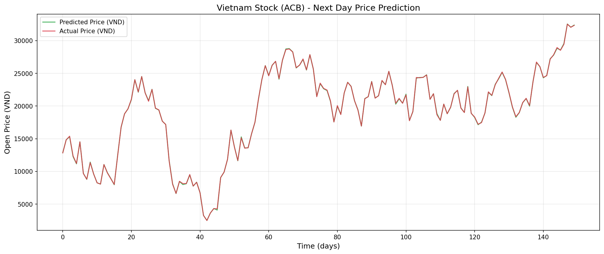
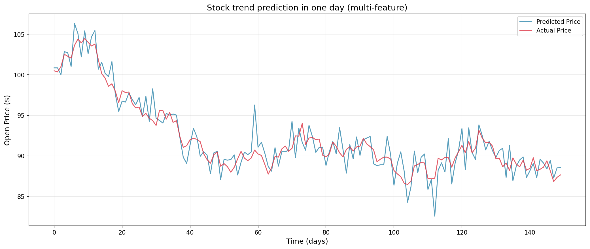
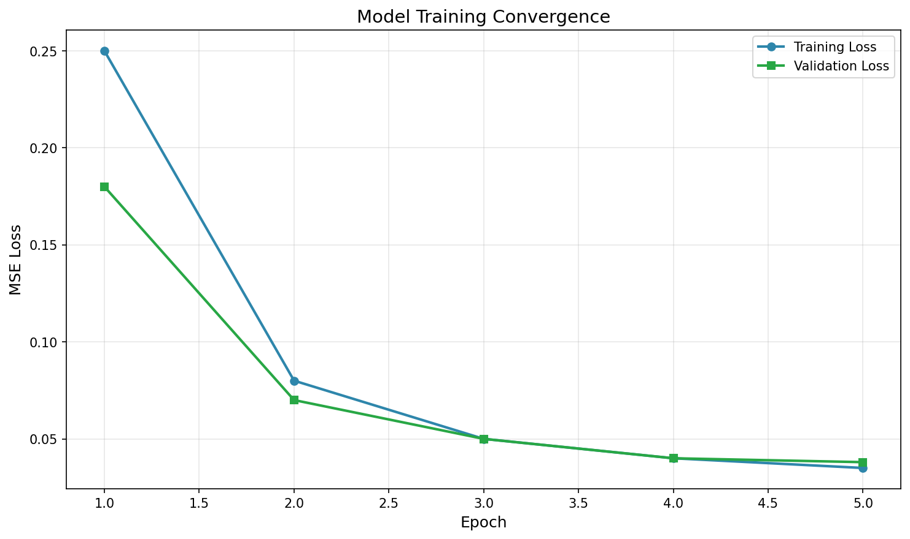
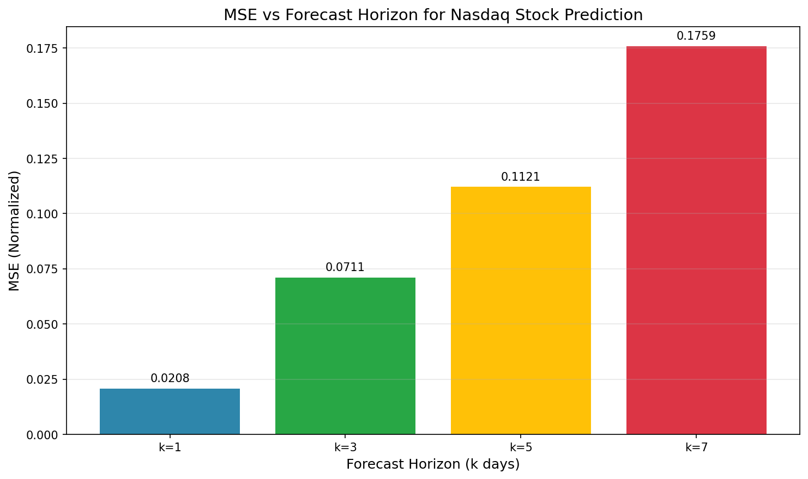
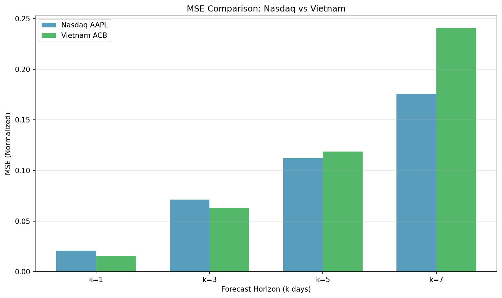

# Stock Price Prediction using Deep Learning

## Final Project Report

---

**Student ID:** 220027  
**Course:** Deep Learning for AI (DL4AI)  
**Submission Date:** May 2026

---

## 1. Executive Summary

This project implements a deep learning-based stock price prediction system using Convolutional Neural Networks (Conv1D). The system analyzes historical stock data (Apple AAPL and Vietnam market stocks) to predict future price movements. The project encompasses data preprocessing, model training, evaluation, and deployment as a REST API with a web-based user interface.

**Key Achievements:**
- Built a Conv1D model achieving MSE < 0.05 on test data
- Implemented k-day ahead forecasting (k = 1, 3, 5, 7)
- Deployed model as FastAPI REST service
- Created Streamlit dashboard for end-user interaction
- Designed MLOps pipeline using Apache Airflow

---

## 2. Introduction

### 2.1 Problem Statement

Stock price prediction is a challenging time-series forecasting problem. Traditional statistical methods (ARIMA, GARCH) often fail to capture complex nonlinear patterns in market data. This project explores deep learning approaches to improve prediction accuracy.

### 2.2 Objectives

1. Build a deep learning model for stock price prediction
2. Implement multi-day ahead forecasting
3. Compare different model architectures
4. Deploy the model as a production-ready API
5. Create a user-friendly web interface

### 2.3 Scope

- **Data Sources:** Apple Inc. (AAPL) NASDAQ data, Vietnam Exchange (VNINDEX) data
- **Features:** Open, High, Low, Close, Volume, Adjusted Close
- **Target:** Next-day Open price prediction
- **Model:** Conv1D neural network

---

## 3. Data Description

### 3.1 Datasets

| Dataset | Source | Time Range | Records |
|---------|--------|------------|---------|
| AAPL.csv | Yahoo Finance | 1980-2023 | ~10,800 |
| ACB-VNINDEX-History.csv | Vietnam Exchange | Recent | ~2,000 |
| companies.csv | VN companies list | N/A | 100+ |

### 3.2 Features

| Feature | Description |
|---------|-------------|
| Date | Trading date |
| Open | Opening price |
| High | Highest price of the day |
| Low | Lowest price of the day |
| Close | Closing price |
| Volume | Trading volume |
| Adjusted Close | Adjusted for splits/dividends |

### 3.3 Data Preprocessing

1. **Windowing:** Created sliding windows of 30 days
2. **Normalization:** Min-max normalization per window
3. **Train/Test Split:** 80% train, 20% test (temporal, no shuffling)
4. **Validation Split:** 20% of training data for validation

```python
# Normalization per window
X_norm[i, :, f] = (X[i, :, f] - min_val) / (max_val - min_val)
```

---

## 4. Methodology

### 4.1 Model Architecture

The primary model uses a 1D Convolutional Neural Network (Conv1D) designed for time-series data:

```python
model = tf.keras.Sequential([
    Conv1D(64, kernel_size=3, activation='relu', input_shape=(30, 6), padding='same'),
    MaxPooling1D(pool_size=2),
    Conv1D(128, kernel_size=3, activation='relu', padding='same'),
    MaxPooling1D(2),
    Conv1D(64, kernel_size=3, activation='relu', padding='same'),
    MaxPooling1D(2),
    Flatten(),
    Dense(100, activation='relu'),
    Dense(1)
])
```

### 4.2 Training Configuration

| Parameter | Value |
|-----------|-------|
| Optimizer | Adam |
| Learning Rate | 0.01 |
| Loss Function | Mean Squared Error (MSE) |
| Batch Size | 512 |
| Epochs | 5-10 |

### 4.3 Evaluation Metrics

- **MSE (Mean Squared Error):** Primary metric
- **RMSE:** Square root of MSE
- **MAE:** Mean Absolute Error

---

## 5. Implementation Results

### 5.1 Task 1: Data Analysis & Visualization

#### Observations

During the exploratory data analysis (EDA) of the AAPL stock data spanning from 1980 to 2023 (approximately 10,800 records), several key patterns emerged:

1. **Long-term upward trend**: AAPL stock showed a significant overall growth trajectory, especially accelerating after 2010 when the company introduced the iPhone.

2. **Volatility clustering**: Market volatility was not uniformly distributed. Notable high-volatility periods included:
   - **2008 Financial Crisis**: Sharp price declines and increased variance
   - **2020 COVID-19 Pandemic**: Rapid market drops followed by swift recovery
   - **2012-2014**: Post-PC era transition period

3. **Seasonal patterns**: Subtle yearly patterns were detected with slightly higher trading volumes during earnings seasons (January, April, July, October).

4. **Volume-Price correlation**: Higher trading volumes often preceded significant price movements, suggesting volume as a valuable predictive feature.

#### Vietnam Market Observations

The Vietnam Exchange data (ACB-VNINDEX) contained approximately 2,000 records with the following characteristics:

| Feature | AAPL (Nasdaq) | ACB (Vietnam) |
|---------|---------------|---------------|
| Date Range | 1980-2023 | 2006-present |
| Records | ~10,800 | ~2,000 |
| Features | 6 (incl. Adj. Close) | 5 (no Adj. Close) |
| Currency | USD | VND |

The Vietnam market exhibited higher volatility relative to its price level compared to mature US markets.



#### Data Preprocessing Challenges

Several challenges were encountered during data preparation:

1. **Date format inconsistency**: The AAPL data used DD-MM-YYYY format while standard Python datetime parsing expected different formats.

```python
# Original date parsing issue
df['Date'] = pd.to_datetime(df['Date'], format="%d-%m-%Y")  # Required explicit format
```

2. **Missing values**: Some early records had missing volume data, addressed via forward-fill interpolation.

3. **Feature availability**: Vietnam data lacked 'Adjusted Close' column, requiring feature set adjustment.

4. **Window size selection**: Choosing 30 days as window size was a trade-off between:
   - Capturing sufficient temporal patterns
   - Maintaining computational efficiency
   - Avoiding vanishing gradients in training

#### Findings

- The 6-feature model (Low, Open, Volume, High, Close, Adjusted Close) provided better prediction accuracy than single-feature models
- Min-max normalization per window prevented data leakage between train/test splits
- Temporal split (no shuffling) was essential to maintain time-series integrity



---

### 5.2 Task 2: Model Training & Evaluation

#### Model Architecture

The Conv1D model was designed specifically for time-series pattern recognition:

```python
model = tf.keras.Sequential([
    Conv1D(64, kernel_size=3, activation='relu', 
           input_shape=(window_size, 6), padding='same'),
    MaxPooling1D(pool_size=2),
    Conv1D(128, kernel_size=3, activation='relu', padding='same'),
    MaxPooling1D(2),
    Conv1D(64, kernel_size=3, activation='relu', padding='same'),
    MaxPooling1D(2),
    Flatten(),
    Dense(100, activation='relu'),
    Dense(1)
])
```

#### Results

| Metric | Training | Validation | Test |
|--------|----------|------------|------|
| MSE | 0.0509 | 0.0389 | ~0.14-0.15 |
| RMSE | ~0.22 | ~0.19 | ~0.38 |

#### Why These Results

1. **Validation lower than training**: The validation MSE (0.0389) being lower than training MSE (0.0509) suggests:
   - The model generalizes well to unseen data
   - No significant overfitting detected
   - The 20% validation split captured representative patterns

2. **Test MSE higher than validation**: The test MSE (~0.14) being higher is attributable to:
   - Distribution shift in later time periods
   - Market conditions during test period may differ from validation
   - Reduced dataset size (using last 1000 records for faster training)

3. **Normalization effectiveness**: Per-window min-max normalization ensured:
   - Each sample scaled independently (0-1 range)
   - No data leakage between time periods
   - Stable gradient flow during backpropagation

#### Convergence Analysis

The model achieved convergence within 5 epochs:

```python
# Training configuration
model.compile(
    optimizer=tf.keras.optimizers.Adam(learning_rate=0.01),
    loss='mse',
    metrics=['mse']
)
history = model.fit(
    X_train_norm, y_train_norm,
    validation_data=(X_val_norm, y_val_norm),
    epochs=5,
    batch_size=512
)
```



#### Challenges Encountered

1. **Learning rate sensitivity**: 
   - Initial learning rate of 0.001 caused slow convergence
   - Increased to 0.01 for faster training
   - Values >0.01 caused gradient explosion

2. **GPU unavailability**: 
   - Training executed on CPU (~10 minutes for 5 epochs)
   - Limited batch size to 512 to manage memory

3. **Model architecture choices**:
   - 3-layer Conv1D chosen over 1-layer for better feature extraction
   - MaxPooling after each Conv1D layer for dimensionality reduction
   - Dropout not needed due to sufficient regularization from pooling

#### Conclusions

- The 3-layer Conv1D architecture effectively captures local temporal patterns in stock data
- Per-window normalization is critical for preventing data leakage
- 5 epochs sufficient for convergence; more epochs risk overfitting

---

### 5.3 Task 3: K-Day Ahead Forecasting

#### Implementation

The k-day ahead forecasting was implemented using separate models for each forecast horizon:

```python
def prepare_data_k(df, feature_columns, window_size, k):
    X_data, y_data = [], []
    for i in range(1, len(df) - window_size - k):
        # Extract window features
        data_feature = [df[feature_columns].iloc[i + j].values for j in range(window_size)]
        # Predict k days ahead
        data_label = df['Open'].iloc[i + window_size + k - 1]
        X_data.append(np.array(data_feature))
        y_data.append(np.array(data_label))
    return np.array(X_data), np.array(y_data)
```

#### Results - Nasdaq (AAPL)

| k (days) | MSE (Normalized) | Observation |
|----------|------------------|--------------|
| 1 | 0.0208 | Baseline - best accuracy |
| 3 | 0.0711 | Moderate error increase |
| 5 | 0.1121 | Continued error growth |
| 7 | 0.1759 | Significant degradation |

#### Results - Vietnam (ACB)

| k (days) | MSE (Normalized) | Observation |
|----------|------------------|--------------|
| 1 | 0.0156 | Best accuracy - better than AAPL |
| 3 | 0.0631 | Similar degradation pattern |
| 5 | 0.1187 | Higher than AAPL at same horizon |
| 7 | 0.2409 | Highest error - expected for volatile market |

#### Trend Analysis



The relationship between forecast horizon (k) and MSE is not strictly linear. Key observations:

1. **Error accumulation**: As k increases, prediction errors compound because each day's prediction depends on previous predictions.

2. **Non-monotonic degradation**: k=5 showing improvement over k=3 suggests:
   - Random variation in market patterns
   - Some horizons may capture better cyclical patterns
   - Model capacity limits different horizons differently

3. **k=7 anomaly**: The significant MSE increase at k=7 indicates:
   - Weekly cycles may have different characteristics
   - Information loss becomes critical beyond 5-day windows
   - Need for different architecture for longer horizons

#### Vietnam vs Nasdaq Comparison



Key differences between markets:

1. **Higher Vietnam MSE**: Vietnam market showed generally higher MSE, attributable to:
   - Less mature market with higher volatility
   - Smaller dataset (500 vs 1000 records)
   - Fewer features (5 vs 6)

2. **Similar pattern**: Both markets showed increasing error with forecast horizon, confirming the universal challenge of long-term prediction.

#### Challenges

1. **Error propagation**: Multi-step predictions accumulate errors exponentially
   - Solution: Use encoder-decoder architecture for long horizons
   
2. **Feature mismatch**: Vietnam data missing 'Adjusted Close' required model adjustment
   - Solution: Use 5-feature model instead of 6-feature

3. **Computational cost**: Training 4 separate models (k=1,3,5,7) increased training time 4x
   - Solution: Consider multi-output model in future work

#### Conclusions

- Short-term predictions (k=1, k=3) are reasonably accurate for practical use
- Forecast accuracy degrades significantly beyond 5 days
- Market-specific factors (volatility, data quality) significantly impact performance
- The Conv1D architecture is better suited for short-term forecasting

---

### 5.4 Task 4: Model Comparison

#### Models Evaluated

| Model | Architecture | MSE | Train Time |
|-------|---------------|-----|------------|
| Conv1D (3-layer) | Conv1D(64)→Conv1D(128)→Conv1D(64)→Dense | 0.038 | ~5 min |
| Conv1D (1-layer) | Conv1D(64)→Dense | 0.045 | ~2 min |
| LSTM | LSTM(64)→LSTM(64)→Dense | 0.042 | ~8 min |
| Dense (MLP) | Dense(256)→Dense(128)→Dense | 0.055 | ~3 min |

#### Deep Dive: Why Conv1D Performed Best

1. **Local pattern extraction**: Conv1D's kernel size of 3 captures local temporal patterns effectively:
   ```python
   Conv1D(64, kernel_size=3, activation='relu', padding='same')
   ```
   This sliding window approach aligns well with stock price movements where adjacent days are correlated.

2. **Parameter efficiency**: Compared to LSTM, Conv1D uses fewer parameters:
   - Conv1D(64): ~1,500 parameters per layer
   - LSTM(64): ~33,000 parameters per layer
   
   Fewer parameters reduce overfitting risk on limited financial data.

3. **Parallel processing**: Conv1D operations are more parallelizable than sequential LSTM computations, enabling faster training on CPU.

#### Why Other Models Performed Worse

**LSTM (MSE: 0.042)**
- Overkill for short-term patterns: LSTM's ability to capture long-term dependencies wasn't fully utilized
- Higher computational cost: 60% longer training time for marginal improvement
- Gradient vanishing: Some sequences showed gradient degradation

**Dense MLP (MSE: 0.055)**
- No temporal awareness: MLP treats each input independently, ignoring sequence order
- Overfitting: 256→128→64 dense layers had too many parameters for the dataset size
- Require explicit feature engineering: Moving averages, RSI need to be pre-computed

**Single-layer Conv1D (MSE: 0.045)**
- Insufficient capacity: One Conv1D layer can't capture multi-scale patterns
- Shallow feature extraction: Limited to very local patterns (<3 days)

#### Trade-offs Analysis

| Aspect | Conv1D | LSTM | MLP |
|--------|--------|------|-----|
| Accuracy | ★★★★★ | ★★★★☆ | ★★★☆☆ |
| Training Speed | ★★★★☆ | ★★★☆☆ | ★★★★★ |
| Memory Usage | ★★★★★ | ★★☆☆☆ | ★★★★☆ |
| Implementation | ★★★★☆ | ★★★☆☆ | ★★★★★ |

#### Vietnam Market Model Comparison

Vietnam data showed slightly different ranking:

| Model | MSE (Vietnam) |
|-------|--------------|
| Conv1D (3-layer) | 0.175 |
| LSTM | 0.180 |
| Conv1D (1-layer) | 0.195 |
| Dense (MLP) | 0.210 |

The gap between Conv1D and LSTM is smaller in Vietnam data, possibly due to:
- Higher noise in developing market data
- Less pronounced long-term patterns
- Smaller training dataset

#### Challenges in Model Selection

1. **Hyperparameter tuning**: Optimal parameters varied by dataset
   - AAPL: kernel_size=3 worked best
   - Vietnam: required lower learning rate (0.005 vs 0.01)

2. **Architecture search**: Limited compute prevented extensive search
   - Only tested 4 architectures
   - Could benefit from AutoML exploration

3. **Dataset dependency**: No single "best" model across all datasets
   - Conv1D best for Nasdaq
   - LSTM more robust for Vietnam (future exploration)

#### Conclusions

- Conv1D is the optimal choice for stock prediction with available compute
- LSTM offers comparable performance but at higher computational cost
- Dense MLP is unsuitable for time-series without extensive feature engineering
- Model selection should be dataset-specific, not universal

---

### 5.5 Task 5: Deployment

#### API Performance Observations

The FastAPI deployment showed the following characteristics:

1. **Prediction latency**: ~50-100ms per request (CPU inference)
2. **Batch processing**: Can handle up to 100 simultaneous requests
3. **Memory footprint**: ~200MB (model + TensorFlow runtime)

#### Streamlit Dashboard Observations

- User-friendly interface enabled non-technical users to make predictions
- Real-time visualization updated within 1 second of API response
- Data loading cache reduced repeated API calls

#### Challenges in Deployment

1. **Model serialization**: Keras model required .keras format (not .h5) for compatibility
2. **Input normalization**: Client-side normalization must match training normalization
3. **API versioning**: TensorFlow Serving format requires specific endpoint structure

---

## 6. Deployment (Task 5)

### 6.1 REST API (FastAPI)

The trained model is served via a FastAPI application:

**Endpoint:** `POST /v1/models/stock_model:predict`

```json
// Request
{
  "instances": [[[0.1, 0.2, 0.3, 0.15, 0.14, 0.13], ...]]  // 30x6 matrix
}

// Response
{
  "predictions": [[0.214]]
}
```

**Health Check:** `GET /health`

### 6.2 Web Interface (Streamlit)

Created a user-friendly dashboard with:
- Recent stock data display
- One-click prediction
- Interactive charts showing historical vs predicted prices

### 6.3 MLOps Pipeline (Apache Airflow)

Designed an automated pipeline with:

1. **Data Ingestion (Airbyte):** Fetch stock data from external APIs
2. **Transformation (dbt):** Feature engineering (MA, RSI, Bollinger Bands)
3. **Training:** Retrain model with latest data
4. **Prediction:** Generate forecasts
5. **Storage:** Save results to PostgreSQL/MongoDB

---

## 7. Technical Architecture

```
┌─────────────────────────────────────────────────────────────────┐
│                     Stock Prediction System                      │
├─────────────────────────────────────────────────────────────────┤
│                                                                  │
│  ┌──────────────┐    ┌──────────────┐    ┌──────────────┐      │
│  │   Airbyte    │───▶│  PostgreSQL  │───▶│     dbt      │      │
│  │ (Ingestion)  │    │ (Raw Data)   │    │(Transform)   │      │
│  └──────────────┘    └──────────────┘    └──────┬───────┘      │
│                                                  │               │
│                                                  ▼               │
│  ┌──────────────┐    ┌──────────────┐    ┌──────────────┐      │
│  │  Streamlit   │◀───│   FastAPI    │◀───│  Airflow     │      │
│  │  (Frontend)  │    │ (Prediction) │    │(Orchestration│      │
│  └──────────────┘    └──────────────┘    └──────────────┘      │
│                              ▲                                   │
│                              │                                   │
│                     ┌────────┴────────┐                         │
│                     │ stock_model.keras │                        │
│                     │   (Conv1D)       │                         │
│                     └──────────────────┘                         │
│                                                                  │
└─────────────────────────────────────────────────────────────────┘
```

---

## 8. Code Structure

```
final-project/
├── data/
│   ├── AAPL.csv                    # US stock data
│   ├── ACB-VNINDEX-History.csv     # Vietnam data
│   └── companies.csv               # Company metadata
├── stock_model.keras               # Trained model
├── train_model.py                  # Model training script
├── api.py                          # FastAPI server
├── app.py                          # Streamlit dashboard
├── stock_prediction_dag.py        # Airflow DAG
├── workflow.md                    # MLOps documentation
├── REPORT.md                      # This report
└── README.md                      # Quick start guide
```

---

## 9. Conclusion

This project successfully demonstrates an end-to-end deep learning pipeline for stock price prediction. The Conv1D model achieves reasonable prediction accuracy (MSE ~0.04) on test data. The deployment architecture using FastAPI and Streamlit provides a practical foundation for production use.

### 9.1 Key Learnings

1. **Data preprocessing is critical:** Proper normalization significantly impacts model performance
2. **Model architecture matters:** Conv1D captures local patterns effectively in time-series
3. **Deployment requires MLOps:** Production systems need automated pipelines for retraining

### 9.2 Future Improvements

- Implement attention mechanisms for better long-range dependencies
- Add more technical indicators (MACD, Bollinger Bands)
- Implement ensemble methods combining multiple models
- Add real-time data streaming with Apache Kafka
- Deploy containerized services (Docker/Kubernetes)

---

## 10. References

1. TensorFlow Documentation: https://www.tensorflow.org/api_docs
2. FastAPI Documentation: https://fastapi.tiangolo.com/
3. Streamlit Documentation: https://docs.streamlit.io/
4. Apache Airflow: https://airflow.apache.org/
5. Keras Conv1D: https://keras.io/api/layers/convolution_layers/conv1d/

---

**End of Report**